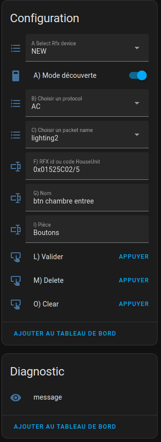

# RFXCOM to MQTT bridge for home assistant
| [](https://github.com/rfxcom/node-rfxcom) | | RFXCOM to MQTT bridge for home assistant |  | [](https://www.home-assistant.io/)|
| :----- | :-- | :----- | :----- | ------: |
||||||

In order for a sensor to be sent to Home Assistant, it must first be declared and then validated by you.

The declaration is either manual or semi-automatic. (Discovery mode in RFXCOM2HASS). Validation is necessary to avoid having a bunch of equipment that fits into HA and that does not concern us (e.g. neighbours' equipment)

The declaration is mandatory manual for certain types of equipment such as SOMFY's RTS shutters.

It is done through a special device in HA: New RFX device.

There is also a New Dio Receiver device to declare paired Dio receivers and buttons (recognised before)

As soon as the validation is done, the material appears in HA, in the right part (automatically created in HA).

> For example, they can be used to manage shutters controlled by DIO 'lighting2' equipment, or Somfy RFY equipment based on the rise and fall times of a shutter. The pseudo-device 'pane' returns the position of the flap. 

Here is the list of settings screens available under HA:
- [Rfxcom Bridge](#rfxcombridgepanel)
- [New Rfx Device](#newrfxdevice)
- [New Dio receiver](#newdioreceiver)
- [New Rfy receiver](#newrfyreceiver)

## Rfxcom Bridge Panel {#rfxcombridgepanel}
The control panel allows you to act on: 
- Addition and removal of protocols expected by RFXCOM2HASS. The list of expected protocols is updated immediately. The diagnostics panel gives various information about the Rfxcom hardware (model, firmware version, etc.) 
- the log level: 'debug' 'info' 'warn' 'error'


## New Rfx Device {#newrfxdevice}
It allows you to add, remove, or change the features of a device. 

The material can be: 
- Automatically discovered (Discovery mode : ON) 
- declared manually (e.g. Somfy RFY)

If the discovery mode is active, the data is filled with the received data, so you must complete it with the name and the part

Ex: For a DIO element, click on discovery, press the dio button, it appears in the panel, disable discovery, complete the description and validate

>for the Dio material (lighting2) I declare a piece 'buttons'. In HA I don't show it. They will allow me to declare a [ new Dio Receiver ](#newdioreceiver).<>



## New Dio Receiver(#newrfxdevice)
It allows you to add, remove, and modify a Dio receiver.
It allows you to declare 2 types of receivers: simple switch (e.g. light) and shutter.

For shutters, it is necessary to know the time it takes to raise and lower the shutter.

A given receiver must necessarily be associated with all the Dio buttons (lighting2) that act on it.
> Ex: I have buttons on each light but also on each level (especially to turn off the whole level), and a button that acts on all the receivers to turn off the whole house when you leave. Each of these buttons will have been declared beforehand.

When HA requests an action on this receiver, it is the 'Rfx Device reference' button that is solicited.

Once the input is complete, you must validate by clicking on the 'press' button of OK. And the receiver is added in HA in the right room.


## [Home Assistant Integration](./docs/usage/integrations/home_assistant.md)

The easiest way to integrate Rfxcom2hass with Home Assistant is by
using [MQTT discovery](https://www.home-assistant.io/integrations/mqtt#mqtt-discovery).
This allows Rfxcom2hass to semi-automatically add devices to Home Assistant.


## Installation
For a docker-free installation, clone the git project. Only the docker installation is explained here.

The available docker images are linux/armV7, linux/armv8, linux/amd64.

The first two allow installation on the Raspberry 2, 3, 4 and 5 in 32 or 64 bits.
I recommend the following procedure: 
- install on Raspberry Pi with docker (I don't explain the docker installation procedure) 
- use the root account (sudo bash) 
- Create the /docker /docker/rfxcom2hass directories 
- in the /docker/rfxcom2hass directory 
    - Create the compose.yml file 
    - Create the dockerrun.sh file 
    - make the files XXX.sh executable 
    - run the./dockerrun.sh file

File Contents: 
- compose-yml: you need to customise variables with < >, remove # from signature data if your mqtt is protected by user/passwd
```
services: 
  rfxcom2hass:
    image: zdid2/rfxcom2hass:latest
    container_name: rfxcom2hass
    privileged: true
    net_mode: host
    environment:
      RFXCOM2HASS_MQTT_SERVER: mqtt://<homeassistant.local>:1883
      #RFXCOM2HASS_MQTT_USERNAME: <username_of_mqtt>
      #RFXCOM2HASS_MQTT_PASSWORD: <passwd_of_mqtt>
      RFXCOM2HASS_LOG_LEVEL: info
      TZ: Europe/Paris
    volumes:
      - "./data:/app/data"
    devices:
      - ${DOCKERDEVICERFX:-/dev/ttyUSB0}:/dev/ttyUSB0
    restart: unless-stopped
```
- dockerrun.sh: Searching for the USB Device and Launching the Program
```
#/bin/sh
DOCKERDEVICERFX=`ls /dev/serial/by-id/ | grep RFX`
DOCKERDEVICERFX=`readlink /dev/serial/by-id/$DOCKERDEVICERFX`
DOCKERDEVICERFX=/dev/${DOCKERDEVICERFX:6}
export DOCKERDEVICERFX
docker compose up -d
#
```
Make the files executable:
```
chmod +x dockerrun.sh
```

## Configuration
On the first run, the configuration files are made available in the data directory.

There are 4 files: 
- config.yml (configuration) 
- devices.yml (list of Rfx devices created by newrfxdevice) 
- VirtualDevices (list of RFY or Dio receivers created by Newdio receiver and others)

### config.yml
```
loglevel: info
healthcheckminutesfrequency: 5 # verification du materiel RFXCOM
homeassistant:
  discovery: false # set to yes in newrfxdevice
  base_topic: rfxcom2hass #prefix du topic pour les états
  discovery_bridge_unique_id: bridge_000001 # au cas ou il y a plusieurs serveurs
  topics: # ne pas toucher
    discovery: homeassistant/device/%discovery_bridge_unique_id%/%device_unique_id%/config
    command: "%base_topic%/%discovery_bridge_unique_id%/%device_unique_id%/%sensortype%"
    state: "%base_topic%/%discovery_bridge_unique_id%/%device_unique_id%/state"
    will: "%base_topic%/%discovery_bridge_unique_id%/status"
    homeassistant_availability: homeassistant/status
    ecoute: "%base_topic%/%discovery_bridge_unique_id%/#"
mqtt: # paramètres mqtt
  base_topic: rfxcom2hass
  qos: 0 # 0 | 1 | 2,
  version: 3 | 4 | 5,
  username: null # user 
  password: null # passwd,
  server: mqtt://localhost:1883  
  key: # 
  ca: # certicat
  cert: # certificat
  keepalive: #
  client_id: # string,
  reject_unauthorized: true false
  format_json?: boolean
  qos: 0
  retain: true
  format_json: true
rfxcom:
  debug: false
  enable_protocols:
    - AC
    - ARC
    - LACROSSE
    - LIGHTWAVERF
    - OREGON
    - X10
  usbport: /dev/ttyUSB0
  transmit:
    repeat: 2
cacheDevices:
  enable: true,
  saveInterval: 1

```


## RfxCom Commands
List of available commands: 
[DeviceCommands](https://github.com/rfxcom/node-rfxcom/blob/master/DeviceCommands.md)


## Dependencies:

The [RFXCOM](https://github.com/rfxcom/node-rfxcom) Node library for the communication with the [RFXCOM](http://www.rfxcom.com) RFXtrx433 433.92MHz Transceiver.

The [MQTT.js](https://github.com/mqttjs/MQTT.js) library for sending and receiving MQTT messages.

