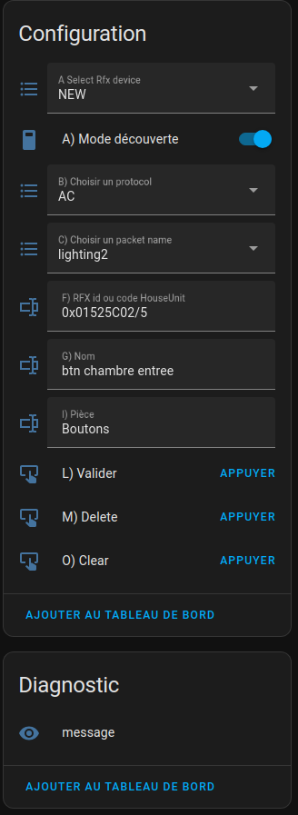

# RFXCOM2HASS UNDER CONSTRUCTION
# RFXCOM2HASS UNDER CONSTRUCTION
# RFXCOM2HASS UNDER CONSTRUCTION
# RFXCOM2HASS UNDER CONSTRUCTION
# RFXCOM2HASS UNDER CONSTRUCTION
# RFXCOM2HASS UNDER CONSTRUCTION

[]() 
[](https://www.home-assistant.io/)


RFXCOM to MQTT bridge for home assistant


All received RFXCOM events are published to the MQTT rfxcom2hass/devices/\<id\>/state topic.
It is up to the MQTT receiver to filter these messages or to have a register/learning/pairing mechanism.

## [Getting started](./docs/README.md)
The [documentation](./docs/index.md) provides you all the information needed to get up and running! Make sure you don't skip sections if this is your first visit, as there might be important details in there for you.

## Usage


### [Home Assistant Integration](./docs/usage/integrations/home_assistant.md)

The easiest way to integrate Rfxcom2hass with Home Assistant is by
using [MQTT discovery](https://www.home-assistant.io/integrations/mqtt#mqtt-discovery).
This allows Rfxcom2hass to semi-automatically add devices to Home Assistant.

A dedicated panel on home assistant allows the setting of new rfx inputs. (New Rfx Device in MQTT appareils )
Automatic Discovery is disable by default.
  
Panel New Rfx Device
(Create and modify existant Rfx Device)
Enable  discovery on panel 
Example: For a DIO element, click on discovery, press the dio button, it appears in the panel, disable discovery, complete the description and validate

Panel New Dio Receiver
(Create and modify existant Rfx Device)
It also allows you to declare elaborate devices: such as lights or blinds.
You will bring up these devices and not the buttons in HomeAssistant

The system is open. You can create other elaborate device programs. You have to add them to the "virtualsdevices" directory, and complete the "index.ts" file of "virtualsdevices"


### Configuration

See example **config.yml**

###
List of available commands: 
[DeviceCommands](https://github.com/rfxcom/node-rfxcom/blob/master/DeviceCommands.md)


### [MQTT Topics and Messages](./docs/usage/mqtt_topics_and_messages.md)

### Healthcheck

If healthcheck is enabled in the config, the rfxcom status will checked every minute.
In case of an error the node process will exit.
If installed in docker the container will try to restart try to reconnect to the RFXCOM device.

----

## Dependencies:

The [RFXCOM](https://github.com/rfxcom/node-rfxcom) Node library for the communication with the [RFXCOM](http://www.rfxcom.com) RFXtrx433 433.92MHz Transceiver.

The [MQTT.js](https://github.com/mqttjs/MQTT.js) library for sending and receiving MQTT messages.

## Development

```
nvm install 18.18
nvm use 18.18
npm install

ts-node src/dev.ts
```

### build docker image

Build a local image

```
docker-compose build
```

build multi Arch image

```
docker buildx build \ 
--platform linux/amd64,linux/arm/v7 \
--push \
-t zdid/rfxcom2hass .
```
